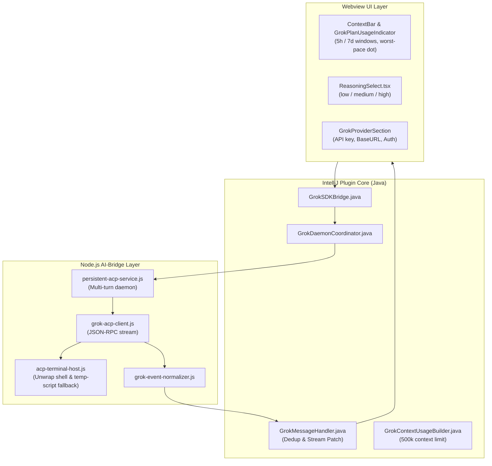

# Grok Beta Comparison Matrix & Enhancement Proposal

**Comparison Baseline:** `upstream/feature/v0.5` (Upstream Grok Beta)  
**Target Solution:** `grok-support` (Persistent ACP Daemon & Advanced Grok Capabilities)  
**Date:** 2026-08-07  

---

## 1. Сводная Матрица Сравнения (Summary Matrix)

| # | Категория / Модуль | Базовая реализация Апстрима (`upstream/feature/v0.5`) | Наша реализация (`grok-support`) | Вердикт & Преимущество `grok-support` |
|---|:---|:---|:---|:---|
| **1** | **Архитектура процессов** | **Ephemeral Single-Turn Spawn** `spawn("grok", ["-p", message, "--output-format", "streaming-json"])` на каждый запрос. Процесс завершается после ответа. | **Persistent Multi-Turn ACP Daemon** `persistent-acp-service.js` + `GrokDaemonCoordinator.java`. Постоянно запущенная сессия JSON-RPC, управляемая демоном. | **`grok-support` лучше** Убирает задержки спауна нового процесса, сохраняет «горячий» контекст процесса. |
| **2** | **Обработка Инструментов (Tools)** | **Файловый опрос (Polling 300ms)** События вызова инструментов не идут в stdout; каждые 300 мс опрашивается `chat_history.jsonl`. | **Native ACP Event Streaming** Вызовы инструментов (`tool_use`) и результаты (`tool_result`) транслируются в реальном времени эвентами ACP. | **`grok-support` лучше** Устраняет задержки файловой системы и риск пропуска строк при частом I/O. |
| **3** | **Управление Правами (Permissions)** | **Жесткий `--always-approve`** Флаг всегда зашит в CLI аргументы. Нет поддержки подтверждения опасных операций. | **Dynamic Live Permission Sync** `setPermissionModeLive` отправляет `grok.setPermissionMode` в работающий демон без сброса ходов. Поддержка диалогов в `Default` режиме. | **`grok-support` лучше** Пользователь имеет контроль над выполнением опасных команд в режиме `Default`. |
| **4** | **Исполнение в Терминале** | **Дефолтный spawn CLI** Падение с ошибкой `exit 127` или искажение команд при сложных bash-скриптах, heredoc, `!` и кавычках. | **ACP Terminal Host & Temp Script Fallback** `acp-terminal-host.js` с `unwrapShellWrapperCommand`, подтягиванием `$SHELL` и автозапуском через temp-скрипт при сложной адресации (обход `noexec`). | **`grok-support` лучше** Полностью убирает ошибки `exit 127` и повреждения кода скриптов. |
| **5** | **Контекстное Окно** | **Не отслеживается** Пользователь не видит объем израсходованного контекстного окна. | **GrokContextUsageBuilder (до 500k токенов)** Подсчет `usage`, кольцо использования в `ContextBar`, защищенное от сброса в 0% по завершении хода. | **`grok-support` лучше** Полная прозрачность объемов контекста (включая лимит 500k у моделей Grok 3 / 4.5). |
| **6** | **Лимиты Квот и Подписок** | **Не отслеживаются** Нет данных о 5h/7d окнах лимитов и подписке Grok. | **GrokPlanUsageIndicator & Worst-Pace Dot** Виджет лимитов подписки (5h / 7d windows), снимки `/usage`, цветная индикация темпа сгорания ресурсов (`grokBillingPace.ts`). | **`grok-support` лучше** Предотвращает неожиданную блокировку по исчерпанию квот. |
| **7** | **Reasoning Effort & Settings** | **Базовый аргумент `--reasoning-effort`** Зашит в общий блок CLI-провайдеров (`CliSection`). | **ReasoningSelect UI & Dynamic Model Cache** Выделенная вкладка `GrokProviderSection`, интерактивный `ReasoningSelect.tsx`, считывание моделей из `~/.grok/models_cache.json`, поддержка `GROK_MODELS_BASE_URL`. | **`grok-support` лучше** Полная поддержка специфичных настроек Grok и кастомных API-прокси. |
| **8** | **Стриминг и Дедупликация** | **Возможно слияние ассистентов** Повторное использование ассистент-пузырей от прошлых ходов. | **GrokMessageHandler** User bubbles редактируются через `patch` вместо `addMessage`, каждый ход создает изолированный экземпляр ассистента. | **`grok-support` лучше** Отсутствие визуальных глитчей и дублей сообщений в UI. |

---

## 2. Архитектурная Диаграмма Интеграции (`grok-support`)

---

## 3. Детализация Компонентов и Ключевых Файлов `grok-support`

### 3.1. Daemon & Transport Layer
* [`ai-bridge/services/grok/persistent-acp-service.js`](file:///Volumes/dx/dev/_home/jetbrains-cc-gui/ai-bridge/services/grok/persistent-acp-service.js) — управление жизненным циклом демона ACP.
* [`ai-bridge/services/grok/grok-acp-client.js`](file:///Volumes/dx/dev/_home/jetbrains-cc-gui/ai-bridge/services/grok/grok-acp-client.js) — клиент JSON-RPC протокола ACP.
* [`src/main/java/com/github/claudecodegui/provider/grok/GrokSDKBridge.java`](file:///Volumes/dx/dev/_home/jetbrains-cc-gui/src/main/java/com/github/claudecodegui/provider/grok/GrokSDKBridge.java) — Java-мост к Node-демону.

### 3.2. Terminal Execution Layer
* [`ai-bridge/services/grok/acp-terminal-host.js`](file:///Volumes/dx/dev/_home/jetbrains-cc-gui/ai-bridge/services/grok/acp-terminal-host.js) — разворачивание системных shell (`unwrapShellWrapperCommand`), предотвращение багов `exit 127`.

### 3.3. Usage, Context & Billing Layer
* [`src/main/java/com/github/claudecodegui/provider/grok/GrokContextUsageBuilder.java`](file:///Volumes/dx/dev/_home/jetbrains-cc-gui/src/main/java/com/github/claudecodegui/provider/grok/GrokContextUsageBuilder.java) — расчет контекстного окна до 500,000 токенов.
* [`webview/src/components/ChatInputBox/GrokPlanUsageIndicator.tsx`](file:///Volumes/dx/dev/_home/jetbrains-cc-gui/webview/src/components/ChatInputBox/GrokPlanUsageIndicator.tsx) — UI-виджет плановых лимитов.
* [`webview/src/utils/grokBillingPace.ts`](file:///Volumes/dx/dev/_home/jetbrains-cc-gui/webview/src/utils/grokBillingPace.ts) — расчёт темпа расхода ресурсов (worst-pace status dot).

### 3.4. Settings & Reasoning Layer
* [`webview/src/components/settings/GrokProviderSection/index.tsx`](file:///Volumes/dx/dev/_home/jetbrains-cc-gui/webview/src/components/settings/GrokProviderSection/index.tsx) — отдельная секция настроек провайдера Grok.
* [`webview/src/components/ChatInputBox/selectors/ReasoningSelect.tsx`](file:///Volumes/dx/dev/_home/jetbrains-cc-gui/webview/src/components/ChatInputBox/selectors/ReasoningSelect.tsx) — переключатель усилий рассуждения (`low`, `medium`, `high`).

---

## 4. Пошаговый План Доработки `upstream/feature/v0.5`

1. **PR 1: Persistent ACP Daemon Architecture**
   - Перевести Grok с одноразового спауна CLI на демонизированный транспорт ACP (`persistent-acp-service.js`).
   - Убрать опрос `chat_history.jsonl` (300ms polling).
2. **PR 2: ACP Terminal Host (Fix Exit 127)**
   - Внедрить `acp-terminal-host.js` для корректного исполнения shell-команд.
3. **PR 3: Live Permission Mode**
   - Реализовать `setPermissionModeLive` и поддержку подтверждений в режиме `Default`.
4. **PR 4: Context Usage Ring (500k Tokens)**
   - Интегрировать `GrokContextUsageBuilder` и кольцо контекста в `ContextBar`.
5. **PR 5: Grok Plan Usage & Billing Pace Indicator**
   - Добавить опрос `/usage` и UI-виджет 5h/7d окон в `ContextBar`.
6. **PR 6: Grok Provider Settings & Reasoning Effort**
   - Выделить `GrokProviderSection` и внедрить селектор `ReasoningSelect`.
